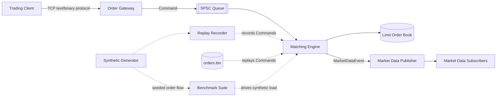

# Low-Latency C++ Matching Engine & Market Data System

A local, offline, educational simulation of an electronic exchange:
order gateway, deterministic price-time-priority matching engine,
limit order book, market-data publishing, replay engine, and a
benchmark/stress-test harness -- built in C++20 for Linux.

> **This project is a local educational and research-oriented
> simulation of exchange infrastructure.** It uses synthetic/local
> data only and does not connect to real financial markets, brokers,
> exchanges, or trading accounts. It is not financial software for
> executing real trades. There is no web scraping, no external data
> dependency, and no network dependency beyond localhost -- everything
> here runs fully offline on a normal developer laptop.

## Architecture



See `docs/architecture.md` for the full component breakdown and design
rationale.

## What's implemented

- **Matching engine**: deterministic, single-threaded critical path,
  price-time priority, limit + market orders, Day/IOC/FOK, new/cancel/
  modify(quantity-reduce), full/partial/multi-level fills.
- **Order book**: price levels keyed by integer-tick `Price` (not
  `double`) via `std::map`, intrusive FIFO linked lists per level
  (zero per-order heap allocation), O(1) best-price/depth queries,
  O(1) average cancel-by-ID via a reserved hash map.
- **Memory**: fixed-capacity `ObjectPool<Order>`, no allocation in the
  matching hot path (see `docs/performance.md` "Where allocations
  happen").
- **Networking**: Linux TCP order-entry gateway, human-readable text
  protocol + compact fixed-size binary protocol, matching engine has
  zero knowledge of sockets.
- **Market data**: strongly-typed event structs
  (`OrderAccepted`/`OrderCancelled`/`OrderModified`/`OrderRejected`/
  `TradeExecuted`/`BookUpdate`) delivered via an event-sink callback.
- **Concurrency**: SPSC lock-free ring buffer with documented
  acquire/release reasoning and false-sharing avoidance
  (`docs/concurrency.md`).
- **Replay engine**: binary record/replay of the command stream,
  verified deterministic (`tests/test_replay.cpp`).
- **Synthetic market-data generator**: seeded/reproducible order flow
  (buys, sells, limit, market, cancels, modifies, bursts) -- the only
  source of order flow anywhere in this project.
- **Benchmarks**: Google Benchmark suite over order-book ops, matching-
  engine ops, and the SPSC queue, plus a Python/Matplotlib
  visualization script. Real measured numbers in `docs/performance.md`.
- **Testing**: 75 GoogleTest cases (unit, invariant, and fuzz/property
  tests) plus a randomized `stress_test` executable that checks book
  invariants, not just speed.
- **Sanitizers**: ASan/UBSan and ThreadSanitizer build modes wired into
  CMake (`EXCHANGE_ENABLE_ASAN` / `EXCHANGE_ENABLE_TSAN`); confirmed
  clean on the development machine (see `docs/performance.md`).

## Build instructions

Requirements: Linux, CMake >= 3.20, a C++20 compiler (GCC or Clang),
internet access on first build only (to fetch GoogleTest and Google
Benchmark via `FetchContent` -- both from `github.com`, MIT/Apache-2.0
licensed, see "Dependencies" below).

```bash
git clone <this-repo>
cd exchange

# Release build (default), includes tests + benchmarks:
./scripts/build.sh

# or manually:
cmake -S . -B build -DCMAKE_BUILD_TYPE=Release
cmake --build build -j$(nproc)
```

Other build modes:

```bash
./scripts/build.sh debug   # -O0 -g, for gdb/valgrind
./scripts/build.sh asan    # AddressSanitizer + UndefinedBehaviorSanitizer
./scripts/build.sh tsan    # ThreadSanitizer
```

## Usage examples

Start the exchange server and connect with the example client:

```bash
./build/exchange --server --port 9999 --symbols AAPL,MSFT
# in another terminal:
./build/exchange_client --host 127.0.0.1 --port 9999
NEW BUY AAPL 100 185.20
NEW SELL AAPL 50 185.15
CANCEL 1 AAPL
MODIFY 2 AAPL 25
```

The server prints accepted orders, trades, cancels, modifies, and
rejections to its own stdout (see `tools/client_main.cpp` for the
scope note on why the demo client doesn't yet parse a response channel
itself).

Generate reproducible synthetic order flow:

```bash
./build/market_generator --orders 1000000 --seed 12345 --out orders.bin
```

Record and replay:

```bash
./build/exchange --record orders.bin --generate 100000 --seed 42
./build/exchange --replay orders.bin
```

Run the test suite:

```bash
./scripts/test.sh          # GoogleTest suite + a stress-test smoke pass
./build/exchange_tests --gtest_filter='MatchingEngineTest.*'
```

Run the stress test (invariant checking over large randomized flow):

```bash
./build/stress_test --orders 500000 --seed 7 --instruments 5
```

Run benchmarks and generate a chart:

```bash
./build/exchange_benchmarks --benchmark_out=results.json --benchmark_out_format=json
python3 scripts/plot_benchmarks.py results.json --out benchmark_report.png
```

Profile with perf / gdb / Valgrind:

```bash
./scripts/build.sh debug
./scripts/profile.sh perf-record --orders 200000 --seed 1 --instruments 3
./scripts/profile.sh perf-stat   --orders 200000 --seed 1 --instruments 3
./scripts/profile.sh gdb         --orders 1000   --seed 1
./scripts/profile.sh valgrind-memcheck    --orders 2000  --seed 1
./scripts/profile.sh valgrind-cachegrind  --orders 20000 --seed 1
```

## Repository layout

```
include/exchange/    public headers, mirrors src/ module layout
src/
  core/               strong types (Price/Quantity/OrderId/...), Order, Command
  orderbook/           price levels, the OrderBook itself
  matching/            MatchingEngine (deterministic, no socket knowledge)
  gateway/             TCP order-entry server, symbol table
  protocol/            text + binary wire formats
  replay/              binary record/replay engine
  tools/                synthetic order-flow generator
  main.cpp             exchange CLI entry point
tools/                 client_main.cpp, market_generator_main.cpp, stress_test_main.cpp
tests/                 GoogleTest suite (unit, invariant, fuzz/property)
benchmarks/            Google Benchmark suite + results/sample_run.json
scripts/               build.sh, test.sh, profile.sh, plot_benchmarks.py
docs/                  architecture, order-book, concurrency, network-protocol,
                        performance, testing deep-dives
config/                default instrument symbol list
CMakeLists.txt
```

## Design tradeoffs (see docs/ for full detail)

- **`std::map<Price, PriceLevel>` over a flat tick-indexed array**:
  chosen for unbounded/arbitrary price ranges across multiple synthetic
  instruments, at the cost of O(log L) instead of O(1) new-level
  insertion (L = number of active price levels, typically small).
  Full discussion and the array-based alternative: `docs/order-book.md`.
- **Single-threaded matching engine**: correctness (exact price-time
  priority, no lost updates) prioritized over parallel throughput,
  which the measured single-thread numbers show isn't needed at this
  project's scale. Full discussion: `docs/concurrency.md`.
- **Thread-per-connection gateway, not epoll/io_uring**: this project's
  latency claims are about the matching core, not connection-count
  scalability. Full discussion: `docs/network-protocol.md`.
- **std::unordered_map for order-ID lookup**: the one heap-backed hash
  map on the hot path, made necessary by the wire protocol referencing
  orders by ID; mitigated by reserving capacity up front. Discussion:
  `docs/order-book.md`.

## Future improvements

- Dedicated market-data output thread over a second SPSC queue (the
  event-sink architecture already supports this as a drop-in change).
- epoll/io_uring-based gateway for higher connection counts.
- Flat tick-indexed array as an alternative `OrderBook` backend for
  instruments with a known, bounded price range.
- Coverage-guided (libFuzzer) fuzzing of the protocol parsers, beyond
  the current seeded pseudo-random property tests.
- Wiring `metrics::LatencyRecorder` into the live gateway/queue
  boundary to measure real queue latency, not just synthetic in-process
  processing latency.
- Structured response channel back to TCP clients (currently the demo
  server prints execution reports to its own stdout).

## Dependencies and licenses

| Dependency                                                     | License                      | Purpose                                             |
| -------------------------------------------------------------- | ---------------------------- | --------------------------------------------------- |
| [GoogleTest](https://github.com/google/googletest) v1.15.2     | BSD-3-Clause                 | Unit testing                                        |
| [Google Benchmark](https://github.com/google/benchmark) v1.9.1 | Apache-2.0                   | Benchmarking                                        |
| Python 3 + [Matplotlib](https://matplotlib.org/)               | PSF / Matplotlib (BSD-style) | Benchmark result visualization (optional, dev-only) |

All fetched via CMake `FetchContent` from their public GitHub
repositories at build time; no proprietary, paid, or unlicensed
dependencies. No cloud infrastructure, paid API, or proprietary
market-data feed is used or required anywhere in this project.

## Correctness disclosures

- Every benchmark number in `docs/performance.md` was produced by an
  actual instrumented run on real hardware on the date noted there --
  none are estimated, extrapolated, or aspirational. The methodology
  to reproduce each one is given alongside it; re-run before quoting
  any number as your own machine's performance.
- All 75 automated tests pass in both a normal Release build and under
  AddressSanitizer + UndefinedBehaviorSanitizer.
- A 200,000-command randomized `stress_test` run completed with zero
  invariant violations on this machine (see `docs/testing.md` and
  `docs/performance.md`).
- The end-to-end TCP path (client -> gateway -> matching engine ->
  trade -> printed execution report) was manually verified working
  over a real loopback socket connection during development.
