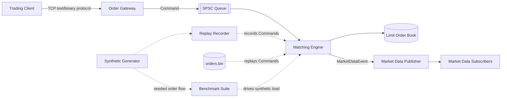

# Architecture

## Overview

The system simulates a simplified electronic exchange: clients submit
orders over TCP using a text (or binary) wire protocol, an order gateway
turns those into typed `Command`s, a single-threaded matching engine
applies price-time-priority matching against a per-instrument limit
order book, and the resulting trades/book changes are published as
market-data events.

## Component responsibilities

| Component | Location | Responsibility |
|---|---|---|
| `core` | `include/exchange/core`, `src/core` | Strong types (`Price`, `Quantity`, `OrderId`, ...), `Order`, `Command` variants |
| `orderbook` | `include/exchange/orderbook`, `src/orderbook` | Price-level book, FIFO queues, best-price/depth queries |
| `matching` | `include/exchange/matching`, `src/matching` | Deterministic price-time-priority matching, no knowledge of sockets |
| `gateway` | `include/exchange/gateway`, `src/gateway` | TCP accept/parse loop, assigns order IDs, no knowledge of matching |
| `protocol` | `include/exchange/protocol`, `src/protocol` | Text and binary wire formats |
| `marketdata` | `include/exchange/marketdata` | Typed event structs (`OrderAccepted`, `TradeExecuted`, ...) |
| `concurrency` | `include/exchange/concurrency` | SPSC ring buffer |
| `memory` | `include/exchange/memory` | Fixed-capacity object pool (no hot-path allocation) |
| `replay` | `include/exchange/replay`, `src/replay` | Binary record/replay of the command stream |
| `metrics` | `include/exchange/metrics` | Latency recording and percentile computation |
| `logging` | `include/exchange/logging` | Lightweight structured logger, kept off the matching hot path |
| `tools` | `include/exchange/tools`, `src/tools`, `tools/` | Synthetic order generator, CLI client, market generator CLI, stress test |

## Why this separation

The matching engine (`MatchingEngine`) never includes a socket header
and never spawns a thread. It receives `Command`s and calls a
caller-supplied `EventSink` callback. This means:

- It can be driven directly and synchronously from unit tests (see
  `tests/test_matching_engine.cpp`) with no network setup.
- It can be driven from the replay engine for deterministic
  regression/performance testing.
- It can be driven from a live gateway thread in production use.
- The wire protocol, transport, and threading model can all change
  independently of matching logic and vice versa.

This mirrors how real exchange/market-making systems are usually
structured: the matching/decision logic is kept as a pure,
synchronous, deterministic core, with I/O and concurrency handled at
the edges.

## Data flow for a single NEW order

1. Client sends `NEW BUY AAPL 100 185.20\n` over TCP.
2. `OrderGateway::handle_client` reads the line, assigns the next
   `OrderId`, and calls `protocol::parse_text_command`.
3. The resulting `Command` (a `NewOrderCommand`) is pushed onto the
   `SpscQueue<Command>` shared with the matching engine thread.
4. The matching engine thread pops the command and calls
   `MatchingEngine::process`.
5. `process` dispatches to `handle_new_order`, which validates the
   order, emits `OrderAccepted` (or `OrderRejected`), attempts to match
   it against the opposite side of the book (`match_against_book`,
   emitting zero or more `TradeExecuted` events), inserts any
   remaining quantity as a resting order if appropriate, and finally
   emits a `BookUpdate` if top-of-book changed.
6. All of these `MarketDataEvent`s are delivered synchronously to
   whatever `EventSink` the engine was constructed with -- in the CLI
   server this prints to stdout; in tests it's a `std::vector` collector.

## Future improvements

- A dedicated market-data output thread consuming events from a second
  SPSC queue (the architecture is already event-sink based, so this is
  a drop-in change: replace the direct callback with `queue.try_push`
  and have a separate thread drain it and fan out to subscribers).
- epoll/io_uring-based gateway for many concurrent connections (current
  gateway is thread-per-connection, adequate for a small number of
  benchmark/demo clients but not for production connection counts).
- Multi-instrument sharding across matching engine instances/threads,
  each still single-threaded internally, coordinated by instrument ID
  hashing at the gateway.
