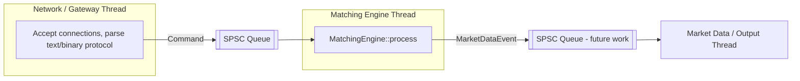

# Concurrency Model

## The matching engine is single-threaded on its critical path, by design

`matching::MatchingEngine::process()` is not thread-safe and is not
meant to be called concurrently from multiple threads. This is a
deliberate engineering decision, not an oversight:

1. **Correctness is worth far more than parallel throughput here.**
   Price-time priority matching, exactly-once fills, and "no lost
   updates" are the entire point of a matching engine. A concurrent
   matching engine (e.g. sharding a single order book across threads,
   or using fine-grained locks per price level) introduces an entire
   class of subtle correctness bugs -- races between a cancel and a
   fill, torn reads of price-level state, reordering of same-price
   orders -- in exchange for throughput this project's workload does
   not need. A single well-optimized thread comfortably processes
   millions of operations per second for one instrument (see
   `docs/performance.md` for actual measured numbers), which is more
   than sufficient for this project's scope.
2. **The matching workload is inherently sequential anyway.** Each
   order can change what the next order matches against (a fill
   changes the best price; a cancel can uncross what looked crossed).
   There is no obvious way to process a stream of orders for the *same*
   instrument in parallel without either serializing on shared state
   (which just reintroduces a critical section) or accepting
   non-deterministic outcomes.

Where parallelism *is* used, it is applied **around** the matching
engine, not inside it:



The current implementation has the gateway thread(s) and the matching
engine thread connected by one `SpscQueue<Command>`
(`include/exchange/concurrency/spsc_queue.hpp`). The
`MatchingEngine`'s `EventSink` callback is invoked synchronously from
the matching thread; routing those events to a second SPSC queue for a
dedicated market-data/output thread is a natural next step (see
`docs/architecture.md` "Future improvements") and requires no change to
the engine itself, since it already speaks in terms of an abstract
sink callback.

## Why SPSC, not MPMC

`concurrency::SpscQueue<T>` is a single-producer/single-consumer ring
buffer. With exactly one producer and one consumer:

- `head_` (next write slot) is only ever *written* by the producer and
  only ever *read* by the consumer.
- `tail_` (next read slot) is only ever *written* by the consumer and
  only ever *read* by the producer.

Neither index is ever contended for *writing* by more than one thread,
so a plain atomic store is sufficient to publish an index update -- no
compare-and-swap retry loop is needed anywhere in `try_push`/`try_pop`.

An MPMC queue needs some mechanism (a CAS loop on the write index, or
per-slot sequence numbers as in the classic Vyukov MPMC queue) to
arbitrate which of several producers "wins" a given slot, and
symmetrically for multiple consumers. That machinery adds branches,
potential retries, and generally worse and less predictable tail
latency under contention -- exactly what a latency-sensitive queue
wants to avoid. SPSC sidesteps this entirely by construction, which is
why it is used here: this project's architecture only ever needs
exactly one producer (the gateway, funneling one command stream into
the engine) and one consumer (the single matching engine thread) per
queue.

## Why acquire/release is sufficient (not `seq_cst`)

Publishing an item in `try_push`:
```cpp
buffer_[head] = std::move(item);          // (1) plain write
head_.store(next_head, memory_order_release); // (2) release store
```

Consuming it in `try_pop`:
```cpp
if (tail == head_.load(memory_order_acquire)) ...  // (3) acquire load
T item = std::move(buffer_[tail]);                  // (4) plain read
```

Release semantics on (2) forbid the compiler/CPU from reordering the
write in (1) to *after* the release store; acquire semantics on (3)
forbid the read in (4) from being reordered to *before* the acquire
load. Together, (1) happens-before (2), and if (3) observes the value
written by (2), then (3) happens-before... no, more precisely: release
(2) synchronizes-with acquire (3) when (3) reads the value stored by
(2), which establishes that everything sequenced-before (2) (i.e. (1))
happens-before everything sequenced-after (3) (i.e. (4)). That is
exactly the guarantee needed: the consumer must never read a slot
before the producer's write to it is visible.

`memory_order_seq_cst` would additionally guarantee a single total
order of *all* seq_cst operations across *all* threads, which this
queue does not need -- there is no third thread that needs to observe
`head_` and `tail_` updates from two different queues (or two
different variables) in a mutually consistent order. The
producer-to-consumer handoff is a pairwise relationship per slot, which
acquire/release expresses precisely and more cheaply (no need for the
extra fence `seq_cst` typically implies on most real hardware/compilers).

`tail_` is published symmetrically: the consumer does a release store
after consuming a slot, and the producer does an acquire load of
`tail_` before checking whether a slot is free to write into -- for the
same reason, in the opposite direction.

## False sharing avoidance

`head_` and `tail_` are each given their own cache line via
`alignas(kCacheLineSize)` (64 bytes), with explicit padding after
`tail_`:

```cpp
alignas(kCacheLineSize) std::atomic<std::size_t> head_{0}; // producer-owned
alignas(kCacheLineSize) std::atomic<std::size_t> tail_{0}; // consumer-owned
char padding_[kCacheLineSize - sizeof(std::atomic<std::size_t>)];
```

Without this, `head_` and `tail_` could share a single 64-byte cache
line despite being logically independent and written by different
threads. Every write to `head_` by the producer would then invalidate
the consumer core's cached copy of the line containing `tail_` (and
vice versa) even though the consumer never touches `head_`'s bytes --
a textbook false-sharing pattern that can dominate a queue's latency
under concurrent access, sometimes by an order of magnitude. Separating
the two onto distinct cache lines eliminates this.

## What is *not* lock-free-claimed without justification

The queue is genuinely lock-free in the formal sense for its intended
single-producer/single-consumer usage: `try_push`/`try_pop` never
block, never spin-wait internally, and always make progress in a
bounded number of steps regardless of what the other thread is doing.
This project does not claim the queue is "lock-free" for any usage
pattern beyond SPSC (e.g. it is not safe with multiple producers or
multiple consumers without additional synchronization), and the class
name (`SpscQueue`) and documentation are explicit about that scope.

## Logging is kept off the matching hot path

`logging::Logger::log()` takes a `std::mutex` and does `fprintf`-based
I/O. This is deliberately **not** called from
`MatchingEngine::process()`'s matching logic -- only from
startup/shutdown code and the network/gateway layer, which are not
latency-sensitive in the same way. See `docs/performance.md`.
